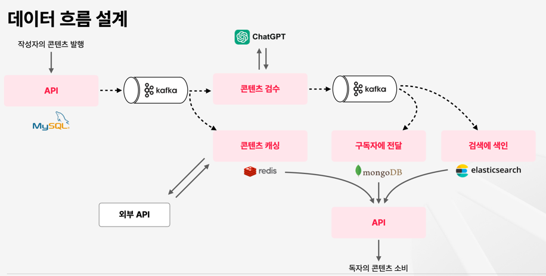

## Event-Driven-Architecture 콘텐츠 플랫폼 구축 
- https://fastcampus.co.kr/dev_online_kafka

### 요구사항
- 사용자는 콘텐츠(Post) 를 발행할 수 있다.
- 사용자는 다른 사용자를 구독(Follow) 할 수 있고, 구독자는 콘텐츠를 받아볼 수 있다.
- 카테고리를 통해 콘텐츠 분류가 가능하다.
- 검색을 통해 콘텐츠를 찾을 수 있다.

